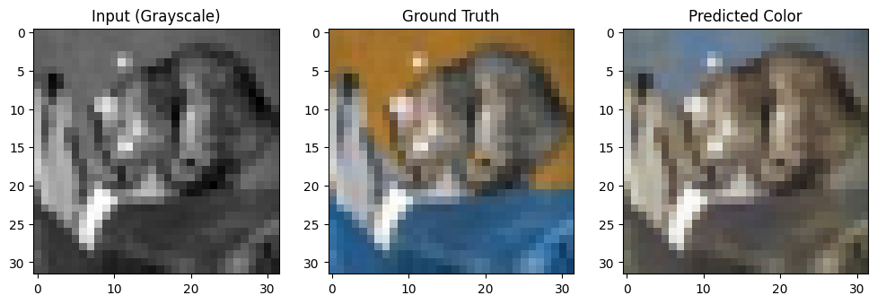
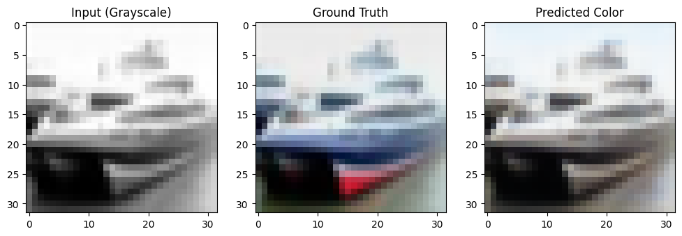
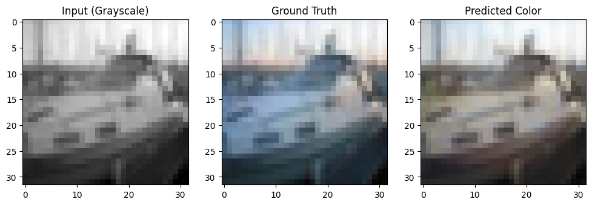
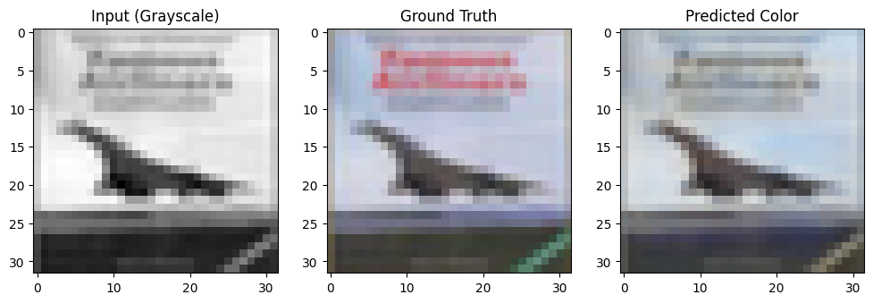
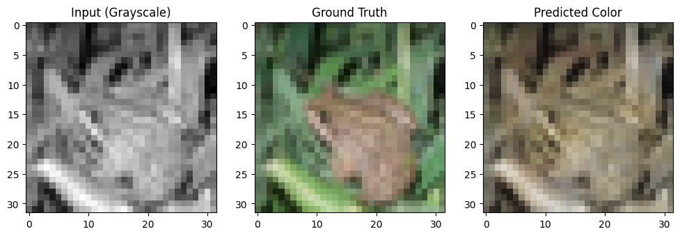

# 🖼️ Colorization of Black & White Images using Deep Learning

This project implements an end-to-end deep learning pipeline to colorize grayscale images using a convolutional encoder-decoder network. It was built and tested on the CIFAR-10 dataset and demonstrates the model's ability to infer plausible colors from 1-channel inputs.

<p align="center">
  
  
  
  
  
</p>

---

## 🚀 Project Overview

- **Goal:** Predict colorized RGB images from grayscale inputs using supervised learning.
- **Model:** Custom CNN-based encoder-decoder architecture built with TensorFlow/Keras.
- **Dataset:** CIFAR-10 (32x32 images, 10 classes)
- **Result:** The model learns to estimate general color tones and textures of natural scenes.

---

## 📁 Dataset

We use the CIFAR-10 dataset provided by Keras:
- 50,000 training images
- 10,000 test images
- Each image is resized to 32×32 and converted to grayscale for input.

---

## 🧠 Model Architecture

- **Encoder:** Two convolutional layers with batch normalization and ReLU.
- **Decoder:** Upsampling and convolution layers to reconstruct 3-channel output.
- Final activation uses `sigmoid` to map values between [0,1].

---

## 🧪 Training Details

- **Loss function:** Mean Squared Error (MSE)
- **Optimizer:** Adam
- **Epochs:** 20 (can be adjusted)
- **Batch Size:** 128

```python
model.fit(
    x_train_gray, 
    x_train_color,
    validation_data=(x_test_gray, x_test_color),
    epochs=20,
    batch_size=128
)
